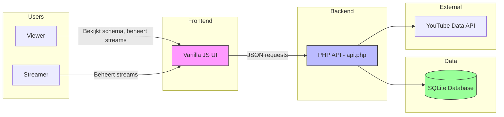
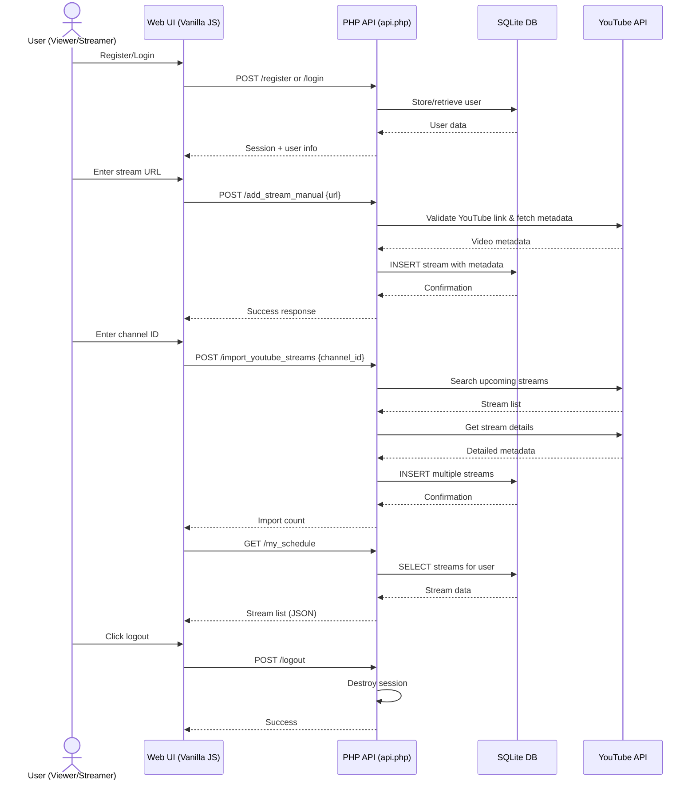
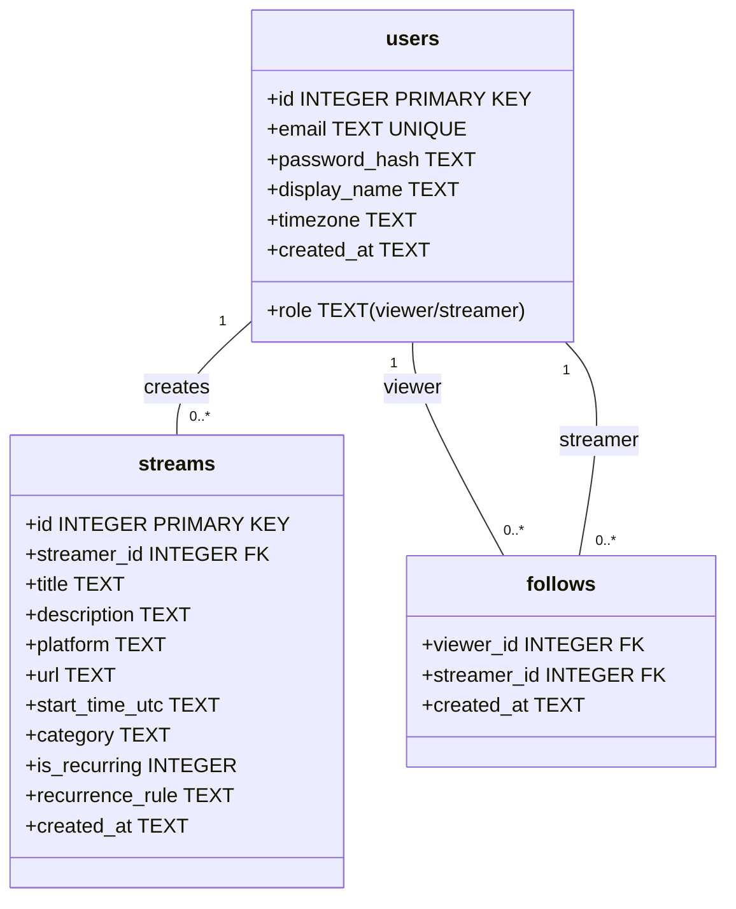

# Updated Architecture Diagrams (V2) - Current Implementation

## Applicatie-overzicht (high-level) - Current Tech Stack

## Datastroom / API-flow - Current Implementation

## Database Schema - Current Implementation

## Key Differences from Original Diagrams

1. **Simplified Tech Stack**:
   - Vanilla JavaScript instead of React/TypeScript
   - PHP backend instead of Node.js/Express
   - SQLite instead of PostgreSQL
   - Session-based auth instead of JWT

2. **Monolithic Architecture**:
   - Single `api.php` file handles all API endpoints
   - No separate services (Auth, Schedule, Notifications, Integrations)
   - No background jobs or notification system

3. **Implemented Features**:
   - ✅ User authentication (register/login/logout)
   - ✅ Stream creation with YouTube validation
   - ✅ Schedule viewing
   - ✅ Follow relationships
   - ❌ No notification system
   - ❌ No email provider integration
   - ❌ No background processing

4. **Current Flow**:
   - All requests go through single PHP endpoint
   - Direct SQLite queries (no ORM)
   - YouTube API integration for stream validation
   - Session-based authentication
   - Simple JSON responses to frontend