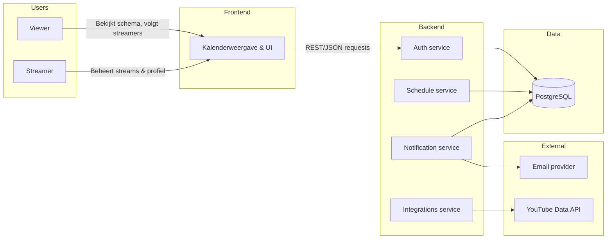
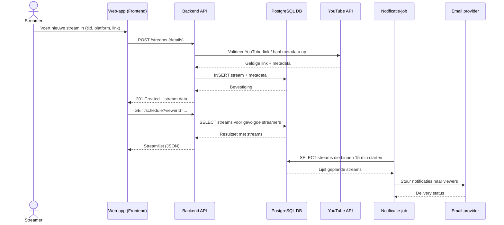

## Applicatie-overzicht (high-level)

```mermaid
flowchart LR
    subgraph Users
        V[Viewer]
        S[Streamer]
    end

    subgraph Frontend
        UI[Kalenderweergave & UI]
    end

    subgraph Backend
        AUTH[Auth service]
        SCHED[Schedule service]
        NOTIF[Notification service]
        INTEG[Integrations service]
    end

    subgraph Data
        DB[(PostgreSQL)]
    end

    subgraph External
        YT[YouTube Data API]
        MAIL[Email provider]
    end

    V -->|Bekijkt schema, volgt streamers| UI
    S -->|Beheert streams & profiel| UI

    UI -->|REST/JSON requests| AUTH

    AUTH --> DB
    SCHED --> DB
    NOTIF --> DB

    INTEG --> YT
    NOTIF --> MAIL
```

## Datastroom / API-flow (voorbeeld)

```mermaid
sequenceDiagram
    actor Streamer as Streamer
    participant UI as Web-app (Frontend)
    participant API as Backend API
    participant DB as PostgreSQL DB
    participant YT as YouTube API
    participant JOB as Notificatie-job
    participant MAIL as Email provider

    %% Stream aanmaken
    Streamer->>UI: Voert nieuwe stream in (tijd, platform, link)
    UI->>API: POST /streams {details}
    API->>YT: Valideer YouTube-link / haal metadata op
    YT-->>API: Geldige link + metadata
    API->>DB: INSERT stream + metadata
    DB-->>API: Bevestiging
    API-->>UI: 201 Created + stream data

    %% Viewer bekijkt schema
    UI->>API: GET /schedule?viewerId=...
    API->>DB: SELECT streams voor gevolgde streamers
    DB-->>API: Resultset met streams
    API-->>UI: Streamlijst (JSON)

    %% Notificaties voor komende stream
    JOB->>DB: SELECT streams die binnen 15 min starten
    DB-->>JOB: Lijst geplande streams
    JOB->>MAIL: Stuur notificaties naar viewers
    MAIL-->>JOB: Delivery status
```

